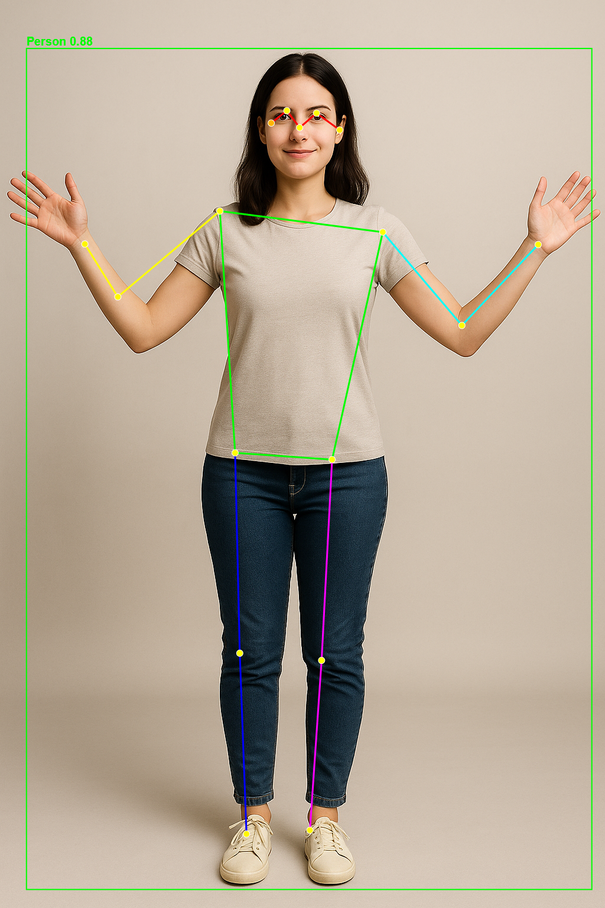
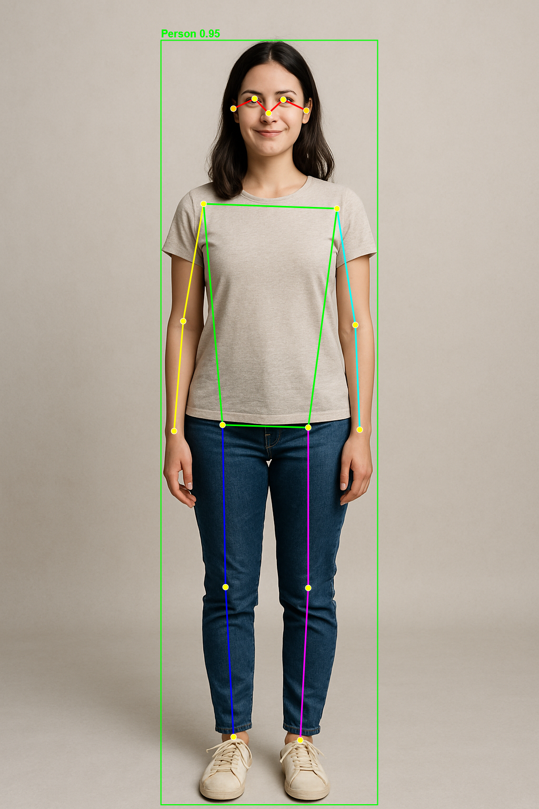

# SimplePoseDotNet

A simple .NET 9 console application for human pose estimation using YOLO11-pose and ONNX Runtime.

> **Note:** This project is for educational purposes to demonstrate pose estimation with ONNX Runtime in .NET.

## Features

- Load and run YOLO11-pose ONNX models
- Detect human poses in static images
- Draw skeleton visualizations with color-coded body parts
- Display detailed keypoint information
- Uses SkiaSharp for high-quality image rendering

## Requirements

- .NET 9 SDK
- YOLO11-pose ONNX model file (included: `yolo11n-pose.onnx` and `yolo11x-pose.onnx`)

## Installation

1. Clone or download this project
2. Restore NuGet packages:
   ```bash
   dotnet restore
   ```
3. Build the project:
   ```bash
   dotnet build
   ```

## Usage

```bash
dotnet run -- <model-path> <image-path> [output-path]
```

### Arguments

- `model-path`: Path to the YOLO11 pose ONNX model file
- `image-path`: Path to the input image file
- `output-path`: (Optional) Path for the output skeleton image (default: `output_skeleton.png`)

### Example

```bash
# Using the nano model (faster, smaller)
dotnet run -- yolo11n-pose.onnx images\armsout.png output.png

# Using the extra-large model (more accurate)
dotnet run -- yolo11x-pose.onnx images\testbody.png result.png
```

### Sample Images

The project includes sample images in the `images/` folder for testing:

#### Arms Out Pose


A person standing with arms extended horizontally - ideal for testing arm keypoint detection.

**Results with YOLO11n-pose (nano model):**
- Confidence: 0.884
- Detection time: Fast



**Results with YOLO11x-pose (extra-large model):**
- Confidence: 0.962
- Detection time: Slower, more accurate


#### Test Body


A person in a neutral standing pose - good for testing overall pose detection accuracy.

**Results with YOLO11n-pose (nano model):**
- Confidence: 0.917
- All 17 keypoints detected with high confidence


**Results with YOLO11x-pose (extra-large model):**
- Confidence: 0.952
- Improved accuracy across all keypoints



## Output

The application will:
1. Load the ONNX model
2. Process the input image
3. Detect all people in the image
4. Print detection results including:
   - Person confidence scores
   - Bounding box coordinates
   - All 17 COCO keypoints with coordinates and confidence
5. Generate a skeleton visualization image with:
   - Green bounding boxes
   - Color-coded skeleton connections
   - Keypoint markers

## Skeleton Color Coding

- **Red**: Face connections
- **Green**: Torso and shoulders
- **Cyan**: Left arm
- **Yellow**: Right arm
- **Magenta**: Left leg
- **Blue**: Right leg

## COCO Keypoints

The model detects 17 keypoints per person:
1. Nose
2. Left Eye
3. Right Eye
4. Left Ear
5. Right Ear
6. Left Shoulder
7. Right Shoulder
8. Left Elbow
9. Right Elbow
10. Left Wrist
11. Right Wrist
12. Left Hip
13. Right Hip
14. Left Knee
15. Right Knee
16. Left Ankle
17. Right Ankle

## Project Structure

```
SimplePoseDotNet/
├── Program.cs                          # Main entry point
├── Models/
│   ├── Keypoint.cs                    # Keypoint data model
│   ├── BoundingBox.cs                 # Bounding box data model
│   └── PoseResult.cs                  # Pose detection result model
├── Services/
│   ├── YoloPoseProcessor.cs           # ONNX model inference
│   └── SkeletonDrawer.cs              # Skeleton visualization
└── Constants/
    ├── KeypointNames.cs               # COCO keypoint names
    └── CocoSkeleton.cs                # Skeleton connections and colors
```

## Dependencies

- **Microsoft.ML.OnnxRuntime** (1.20.1): ONNX Runtime for model inference
- **SkiaSharp** (3.116.0): Cross-platform 2D graphics library

## License

This is an educational demonstration project for learning pose estimation with ONNX Runtime and .NET. Use as needed.
